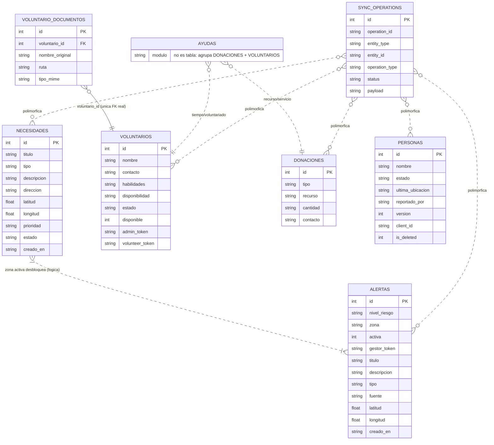

# Modelo Entidad-Relación — Nexo (fuente única de verdad)

> Borrador de consenso del modelo de datos. Toda columna o tabla nueva se
> acuerda AQUÍ primero y luego se implementa en una sola migración, para
> evitar conflictos al integrar ramas (el problema detectado en el PR #33).

## Entidades y atributos

### necesidades (núcleo) — rediseño G1 (Sprint 2, PR #61 / #56: 8 categorías, 2 estados)
- `id` PK · `titulo` TEXT DEFAULT '' (opcional; si vacío, `services.py` lo genera desde `tipo`) · `tipo` (CHECK: agua/alimentos/parafarmacia/ropa/higiene/refugio/transporte/otros)
- `descripcion` TEXT DEFAULT '' (opcional) · `direccion` TEXT DEFAULT '' (texto legible geocodificado; ver `geocodificacion.js`) · `latitud` REAL · `longitud` REAL
- `prioridad` (CHECK: baja/media/alta/critica) · `estado` (CHECK: abierta/cubierta — se retiró `en_proceso`) · `creado_en`

### voluntarios
- `id` PK · `nombre` · `contacto` · `habilidades` · `disponibilidad` · `creado_en`
- `estado` (CHECK: pendiente/aprobado/rechazado) · `disponible` (0/1)
- `admin_token` · `volunteer_token`
- **FK:** `voluntario_documentos.voluntario_id` → `voluntarios.id` (ON DELETE CASCADE)

### voluntario_documentos
- `id` PK · `voluntario_id` FK · `nombre_original` · `ruta` · `tipo_mime` · `creado_en`

### donaciones (parte de Ayudas — recurso/servicio)
- `id` PK · `tipo` · `recurso` · `cantidad` · `contacto` · `creado_en`

### alertas (núcleo, Grupo 2 — activación de crisis)
- `id` PK · `nivel_riesgo` (CHECK: bajo/medio/alto) · `zona` TEXT (GeoJSON Polygon)
- `activa` INTEGER (0/1) · `gestor_token` · `titulo` · `descripcion`
- `tipo` (opcional, reusa EventTypeEnum) · `fuente` (DEFAULT 'gestor')
- `latitud` REAL · `longitud` REAL · `creado_en`
- Creada en `004_alertas_gestor.sql` (Sprint 2, acordada en este modelo).

### ayudas (concepto Sprint 2 — unifica donación + voluntariado)
- Módulo de negocio que agrupa `donaciones` (tipos `recursos`/`servicios`) y
  `voluntarios` (tipo `tiempo`/voluntariado, con `nombre` + `DNI`).
- Contrato hacia el mapa: `{id, type, category, latitude, longitude, status}`.
- No es una tabla nueva en el MVP: reutiliza `donaciones` y `voluntarios`.

### personas (registro "estoy bien" + sincronización offline)
- `id` PK · `nombre` · `estado` (desaparecida/localizada/estoy_bien) · `ultima_ubicacion`
- `reportado_por` · `creado_en`
- `version` INTEGER DEFAULT 1 · `client_id` TEXT · `updated_at` TIMESTAMP · `is_deleted` INTEGER DEFAULT 0
  (de `002_sync_setup.sql`)
- `edad` INTEGER · `descripcion` TEXT  ← **REQUERIDAS por el código G4; actualmente AUSENTES en migraciones**

### sync_operations (auditoría de sincronización offline)
- `id` PK · `operation_id` UNIQUE · `entity_type` · `entity_id` · `operation_type` (CHECK)
- `status` (CHECK) · `payload` (JSON) · `client_created_at` · `server_processed_at`
- `error_code` · `error_message` · `created_at`

### sync_log (LEGACY)
- `id` PK · `modulo` · `accion` · `payload` · `procesado_en`
- Creada en `001_init.sql`; **solapa con `sync_operations`** → decidir deprecar.

## Relaciones

> **Solo existe 1 FK real en toda la BD:** `voluntario_documentos.voluntario_id → voluntarios.id`
> (ON DELETE CASCADE, en `002_voluntario_validacion.sql`). El resto son relaciones de
> **lógica de negocio**, no restricciones SQL (por diseño de sincronización offline).

- **FK real:** `voluntario_documentos` N:1 `voluntarios` (`voluntario_id` → `voluntarios.id`).
- `ayudas` (módulo) agrupa `donaciones` y `voluntarios` — criterio de negocio, **sin FK ni tabla nueva**.
- `alertas` desbloquea `necesidades`/`ayudas` por **solape de `zona` (GeoJSON)** vs coordenadas — lógica, no FK.
- `sync_operations` referencia cualquier entidad por `(entity_type, entity_id)` — relación
  débil/polimórfica, **sin FK estricta** (texto, no entero).
- Contratos hacia el mapa (no persistidos): `alerta→mapa {id, risk_level, status, zone}`,
  `necesidad→mapa {id, type, latitude, longitude, status}`,
  `ayuda→mapa {id, type, category, latitude, longitude, status}`.

### Correcciones sobre el DSL previo (dbdiagram.io / Gemini)
El DSL generado por Gemini contenía relaciones **inexistentes**; no deben registrarse como FK:
1. `DONACIONES.id - VOLUNTARIOS.id` → **falso**; `donaciones` no tiene FK (es agrupación lógica de Ayudas).
2. `ALERTAS.id < NECESIDADES.id` → **falso**; la activación es por `zona`, no por `id`.
3. `PERSONAS.reportado_por > VOLUNTARIOS.id` → **falso**; `reportado_por` es `TEXT` libre, no FK.
4. `SYNC_OPERATIONS.entity_id > NECESIDADES.id` → **falso**; `entity_id` es `TEXT` polimórfico.
5. `database_type: 'PostgreSQL'` → **erróneo**; la BD real es **SQLite**.

## Diagrama (Mermaid)

> Render del modelo (corregido, generado desde el bloque Mermaid de arriba):
> 
> - [Versión PNG](NEXO_Emergencias_Y_Ayudas.png)
> - [Fuente dbdiagram.io corregida (DSL arriba) — el `.html` adjunto es un export previo, reexportar desde el DSL](NEXO_Emergencias_Y_Ayudas.dbdiagram.html)



### DSL corregido para dbdiagram.io (fuente editable)

```sql
Project Sistema_Emergencias_Y_Ayudas {
  database_type: 'SQLite'
  Note: 'Modelo ER corregido - 1 sola FK real (voluntario_documentos.voluntario_id)'
}

Table NECESIDADES {
  id integer [primary key]
  titulo varchar
  tipo varchar
  descripcion varchar
  direccion varchar
  latitud real
  longitud real
  prioridad varchar
  estado varchar
  creado_en varchar
}
Table VOLUNTARIOS {
  id integer [primary key]
  nombre varchar
  contacto varchar
  habilidades varchar
  disponibilidad varchar
  estado varchar
  disponible integer
  admin_token varchar
  volunteer_token varchar
}
Table VOLUNTARIO_DOCUMENTOS {
  id integer [primary key]
  voluntario_id integer [ref: > V.VOLUNTARIOS.id]
  nombre_original varchar
  ruta varchar
  tipo_mime varchar
}
Table DONACIONES {
  id integer [primary key]
  tipo varchar
  recurso varchar
  cantidad varchar
  contacto varchar
}
Table ALERTAS {
  id integer [primary key]
  nivel_riesgo varchar
  zona varchar
  activa integer
  gestor_token varchar
  titulo varchar
  descripcion varchar
  tipo varchar
  fuente varchar
  latitud real
  longitud real
  creado_en varchar
}
Table PERSONAS {
  id integer [primary key]
  nombre varchar
  estado varchar
  ultima_ubicacion varchar
  reportado_por varchar
  version integer
  client_id varchar
  is_deleted integer
}
Table SYNC_OPERATIONS {
  id integer [primary key]
  operation_id varchar
  entity_type varchar
  entity_id varchar
  operation_type varchar
  status varchar
  payload varchar
}
Table AYUDAS {
  modulo varchar [note: 'no es tabla: agrupa DONACIONES + VOLUNTARIOS']
}

// UNICA FK REAL:
Ref: VOLUNTARIO_DOCUMENTOS.voluntario_id > VOLUNTARIOS.id
// Relaciones LOGICAS (no FK):
Ref: AYUDAS.modulo - DONACIONES.id [note: 'logica: donaciones = recurso/servicio']
Ref: AYUDAS.modulo - VOLUNTARIOS.id [note: 'logica: voluntarios = tiempo']
Ref: ALERTAS.zona - NECESIDADES.id [note: 'logica por zona GeoJSON, no por id']
// SYNC es polimorfico por (entity_type, entity_id): no es FK a una tabla
```

> `AYUDAS` es un módulo de negocio (no tabla): agrupa `DONACIONES` y `VOLUNTARIOS`.
> `ALERTAS` desbloquea `NECESIDADES`/ayudas por coincidencia de zona (lógica, no FK).

## Conflictos detectados al integrar (histórico)
1. `personas` se altera en `002_sync_setup.sql` (version/client_id/updated_at/is_deleted) y el
   PR #33 de Isabela **elimina esos ALTERs**, pero su código usa `edad`/`descripcion` que no
   existen en ninguna migración → conflicto de merge y tabla incompleta.
2. Dos tablas de sync (`sync_log` y `sync_operations`) con propósitos solapados.
3. `edad` y `descripcion` requeridas por el código G4 no están en ninguna migración.
4. Dos archivos con prefijo `002_` → orden frágil y edición concurrente del mismo `.sql`.
5. `alertas` (Grupo 2) añadida en Sprint 2 vía `004_alertas_gestor.sql`; ya acordada en este modelo, sin solape con las tablas existentes.

## Propuesta de reconciliación
- **Fuente única:** este modelo ER. Toda decisión de datos se acuerda aquí.
- **`personas`:** definir todas sus columnas (incl. `edad`, `descripcion`) en UN solo lugar
  (ampliar `002_sync_setup.sql` o crear `003_personas_sync.sql` estable). No volver a editar
  el mismo `.sql` desde varias ramas.
- **Sync:** elegir `sync_operations` como tabla canónica; marcar `sync_log` como legacy.
- **Una migración por cambio de modelo**, numerada en secuencia (`001`, `002`, `003`...),
  sin prefijos duplicados.
