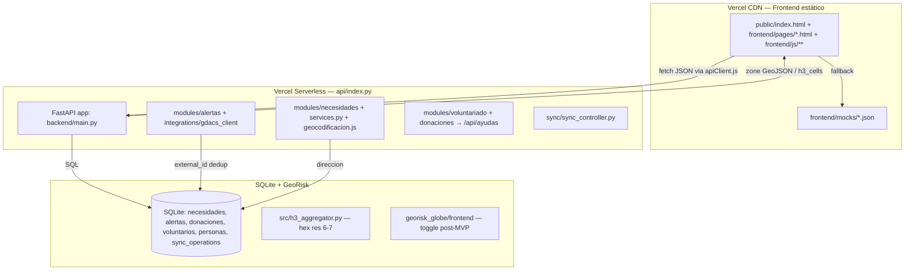
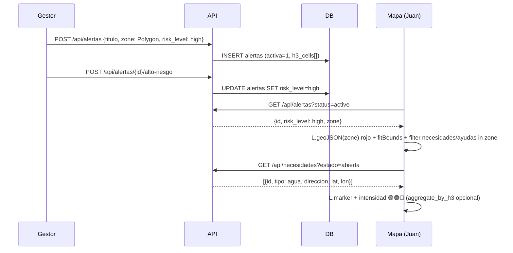

# Arquitectura — Anexo Risk (NEXO × GeoRisk)

> **Evolución de NEXO:** Anexo Risk mantiene función NEXO (mapa protagonista, ALTO RIESGO desbloquea necesidades/ayudas) + inteligencia GeoRisk (H3, globo, clustering). `main` bloqueada, `anexo-risk` rama única de integración → `main`. Legacy NEXO/GeoRisk en `docs/legacy/README.md`.

## Visión general (Jamstack Vercel)

- **Frontend:** HTML/CSS/JS puro sin build, PWA. Cada página (`frontend/pages/*.html`) carga su módulo JS. `frontend/js/shared/apiClient.js` único cliente (`fetch` centralizado, sin `fetch` disperso).
- **Backend:** FastAPI bajo `/api/*`. Cada módulo autocontenido: `routes.py`, `schemas.py` (Pydantic con `alias` español/inglés), `services.py`, `models.py`. Reexportado como serverless en `api/index.py` (`from backend.main import app`).
- **BD:** SQLite sin ORM (simple, idempotente). `backend/db/migrations/001_init.sql` + `004_necesidades_direccion.sql` + `005_necesidades_redisenio.sql` (8 cats, 2 estados, `direccion`). `docs/modelo-entidad-relacion.md` es fuente única (1 FK real).
- **Despliegue:** `vercel.json` rewrites `/api/*` → `api/index.py` (`@vercel/python`) y `frontend/**` → `@vercel/static`. `dev`/`anexo-risk` → Preview, `main` → Producción.

## Módulos y propiedad (4p, 1 archivo dueño)

| Módulo | Persona | Rama | Archivos clave |
|---|---|---|---|
| **G2 Alertas** | Javi | `feat/javi-g2-alertas` | `backend/modules/alertas/*`, `integrations/gdacs*`, `backend/config.py` |
| **G4 Mapa** | Juan | `feat/juan-g4-mapa` | `frontend/pages/mapa.html`, `mapaNecesidades.js`, `apiClient.js`, `georisk_globe/` (post-MVP) |
| **G1 Necesidades** | Luis | `feat/luis-g1-necesidades` | `backend/modules/necesidades/*`, `formularioNecesidad.js`, `geocodificacion.js`, `necesidadesApi.js` |
| **G3 Ayudas** | Vanessa | `feat/vanessa-g3-ayudas` | `backend/modules/voluntariado/*`, `donaciones/*` → `POST /api/ayudas`, `frontend/js/core/voluntariado-donaciones/**` |

Ver detalle en `docs/equipos/reparto.md` (único archivo, 5 tareas c/u, sin solapes).

## Flujo ALTO RIESGO (producto integral)

Contratos: `alerta→{id,risk_level,status,zone,h3_cells}`, `necesidad→{id,type,lat,lon,status,direccion}`, `ayuda→{id,type,category,lat,lon,status}`.

## GeoRisk — qué se reutiliza

- **H3 (`src/h3_aggregator.py`):** `lat_lon_to_h3`, `aggregate_by_h3`, `merge_h3_datasets` (res 6-7) para intensidad y test punto-en-zona. No bloquea MVP (MVP usa `turf.booleanPointInPolygon`), post-MVP para hex grid.
- **Globo (`georisk_globe/frontend`):** toggle `?globe=1` post-MVP, no para demo Jueves.
- **Descartado para MVP:** `streamlit_app/`, `notebooks/figures`, `data/processed/*.csv` pesados (regenerables), `visualization.py` Folium (solo notebooks).

## Modo offline

1. `apiClient.js` intenta `fetch`.
2. Si falla red → guarda en IndexedDB `localDb.js` vía `syncQueue.js`.
3. Evento `online` → `app.js` llama `procesarColaPendiente()` → `POST /api/sync`.
4. Backend `sync/sync_controller.py` aplica y loguea en `sync_operations` (polimórfica `entity_type`/`entity_id`, sin FK).

## Alertas — Fuente única GeoRisk

`services.py:fetch_base_alerts()` → `gdacs_client.get_alerts()` + `proteccion_civil_client.get_alerts()` → fallback `gdacs_mock.MOCK_GDACS_DATA` `[]` sin 500. Deduplicación por `external_id` (`GDACS_1234`) vs BD local. `COUNTRY_ALIASES` normaliza `españa→spain` para filtro `pais`.

## Seguridad y convenciones

- Código inglés, comentarios/docs español. `Field(alias="fuente")` mantiene contrato español sin romper front.
- `main` protegida: Require PR + `backend-tests` + `frontend-lint` (ver `.github/workflows/ci.yml`).
- Una migración por cambio, numerada `001,004,005...` sin prefijo duplicado (ver `docs/modelo-entidad-relacion.md` § Propuesta).
